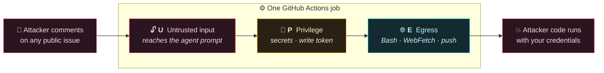
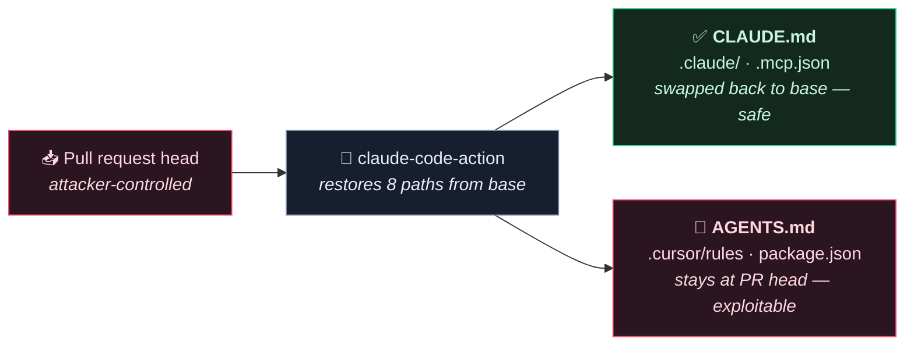
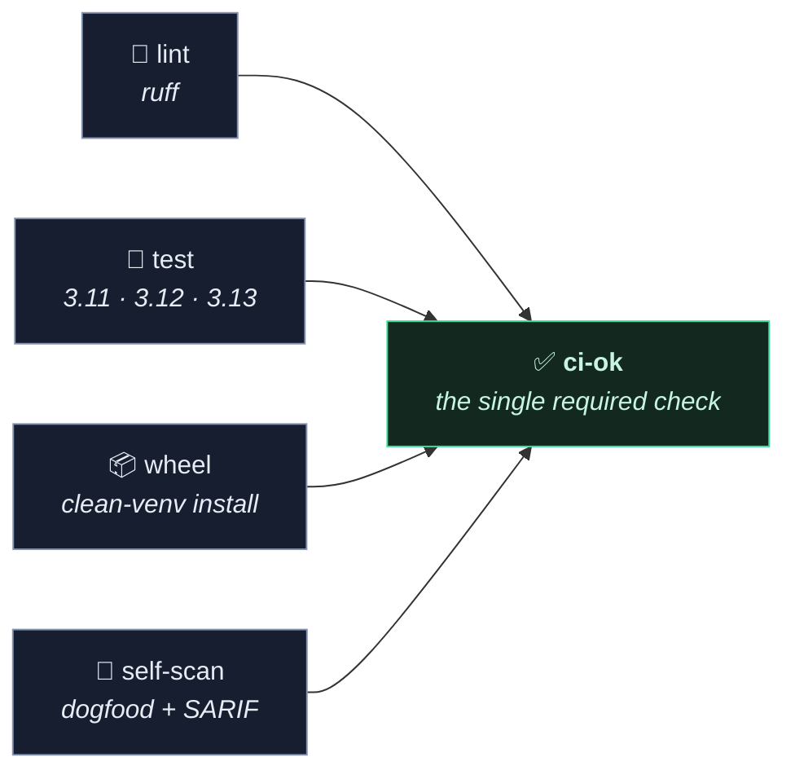

<div align="center">

# 🔺 TriDelPhi

### Find the CI job that turns a comment into remote code execution — before an attacker does.

[](https://github.com/girnarholdings/TriDelPhi/actions/workflows/ci.yml)
[](https://girnarholdings.github.io/TriDelPhi/)
[](https://pypi.org/project/tridelphi/)
[](LICENSE)
[](#-offline-by-design)

**[🌐 Website](https://girnarholdings.github.io/TriDelPhi/)** ·
**[📖 Rules](docs/RULES.md)** ·
**[🧭 Decisions](docs/DECISIONS.md)** ·
**[⚙️ Setup](docs/REPO_SETUP.md)**

</div>

---

```console
$ pipx install tridelphi
$ tridelphi .
```

```
tridelphi 0.1.0 · Agents Rule of Two · 6 workflows, 20 jobs, 0.2s, offline

START HERE ────────────────────────────────────────────────────────────
CRITICAL .github/workflows/assist.yml:19   job "assist"
  tridelphi/agent-prompt-injection

  U  ${{ github.event.comment.body }} is interpolated into Claude Code
     Action's prompt input; the agent treats that text as instructions
  P  secrets.ANTHROPIC_API_KEY is available to this job
  E  Claude Code Action can use Bash, WebFetch

  Cheapest fix: strip U — gate the job on the commenter's association
  so only trusted accounts reach it. Escaping does not help; the
  injection is semantic, not syntactic.

  1 critical · 0 warning · 0 note
```

---

## 🎯 The problem

In 2026 the dangerous CI jobs stopped *looking* dangerous. An AI agent that
reviews pull requests, a workflow that triages issues with an LLM, a
`pull_request_target` that checks out a fork — each is one crafted comment away
from running attacker code **with your repository's secrets**.

Line-level linters miss it because no single line is wrong. **The danger is the
combination.**



## ⚖️ The rule: two is fine, three is an exploit

[Meta's **Agents Rule of Two**](https://ai.meta.com/blog/practical-ai-agent-security/)
says an agent should hold **at most two** of three properties. A GitHub Actions
job is an agent by that definition.

| | Capability | What TriDelPhi looks for |
|:--:|---|---|
| 🔓 | **U** — untrusted input | Fork-reachable trigger **plus a real ingress path**: an injected `${{ github.event.* }}`, a checkout of PR code, or an agent reading files the PR can edit |
| 🔑 | **P** — privilege | `secrets.*`, a write-scoped token, `id-token: write`, or a self-hosted runner |
| 🌐 | **E** — egress | Any `run:` step, a publish/deploy action, or an agent with `Bash`/`WebFetch` |


> **It stays quiet on the compliant majority.** A deploy job with a secret and a
> shell is *supposed* to exist. TriDelPhi does not cry wolf on it — that is the
> difference between a tool people keep and one they mute.

## 🛡️ The part no other scanner does

TriDelPhi knows **what each AI agent action restores from the base branch**.



A filename-matching scanner gets this **wrong in both directions**: it flags
`CLAUDE.md` (a false positive on the hardened, recommended setup) and it has
nothing to say about `AGENTS.md` (the real finding). Getting that distinction
right requires a per-action, per-version model of restore behaviour — which is
the part that has to be maintained, and the part nobody else maintains.

## 🧭 Coverage against a published taxonomy

`tridelphi --coverage` maps every rule onto [Uber's **ADR**](https://github.com/uber/ADR)
17 agent threat techniques (MLSys 2026, arXiv:2605.17380) — and says plainly
where static analysis **cannot** reach:

```
[x] Agentic Control-Flow Hijacking             detected
[x] Indirect Prompt Injection                  detected
[x] Exploitation of Excessive Tool Permissions detected
[ ] Tool Shadowing                             gap — statically reachable, no rule yet
[-] Long-Term Goal Hijacking                   runtime-only
...
8 of 11 statically reachable techniques have a rule; 6 of 17 are runtime-only.
```

**ADR is the runtime half; TriDelPhi is the static half.** ADR observes agent
sessions and detects hijacking as it happens. TriDelPhi finds the jobs where
those attacks would land, before anything runs. Roughly a third of the taxonomy
is runtime-only by nature — no repository content distinguishes a benign session
from a hijacked one — and the report says so rather than claiming coverage it
does not have.

## 📦 Install

```console
pipx install tridelphi          # recommended — isolated
pip install tridelphi           # or into your environment
uvx tridelphi .                 # or run without installing
```

Python 3.11+. One runtime dependency: `ruamel.yaml`.

## 🚀 Use it

```console
tridelphi .                                    # scan, human-readable
tridelphi . --format html --html-file out.html # a page you can share
tridelphi . --format sarif --sarif-file s.json # for GitHub code scanning
tridelphi --explain agent-config-ingress       # what a rule means and why
tridelphi --coverage                           # ADR taxonomy coverage
tridelphi --list-rules                         # every rule at a glance
```

### 🔁 The ratchet — stop the count from rising

You cannot fix everything today. Freeze what exists, block only what is new:

```console
tridelphi . --write-baseline   # once: record today's findings
tridelphi .                    # from now on, only new findings count
```

Fingerprints ignore line numbers, so adding a step above a job does not re-flag it.

### 🤝 Add zizmor's line-level checks

TriDelPhi finds the **combination**; [zizmor](https://github.com/zizmorcore/zizmor)
finds the **commodity** problems — unpinned actions, mutable tags, line-level
template injection. Complementary, so run both into one merged SARIF:

```console
pipx install zizmor
tridelphi . --with-zizmor --format sarif --sarif-file out.sarif
```

zizmor's findings land as a second SARIF run. If zizmor isn't installed,
`--with-zizmor` prints a note and TriDelPhi's own findings are unaffected — it
never fails a scan over a missing optional tool. Stays offline unless you add
`--zizmor-online`.

## ⚡ Put it in CI

```yaml
name: tridelphi
on:
  pull_request:
  push: { branches: [main] }
permissions:
  contents: read
  security-events: write
jobs:
  rule-of-two:
    runs-on: ubuntu-latest
    steps:
      - uses: actions/checkout@v4
      - uses: actions/setup-python@v5
        with: { python-version: '3.12' }
      - run: pipx install tridelphi
      - run: tridelphi . --format text --sarif-file tridelphi.sarif
      - uses: github/codeql-action/upload-sarif@v3
        if: always()          # the scan exits non-zero on findings; upload anyway
        with: { sarif_file: tridelphi.sarif }
```

### 🚦 Exit codes

| Code | Meaning |
|:--:|---|
| `0` | no findings at or above `--fail-on` (default `critical`) |
| `1` | findings at or above `--fail-on` |
| `2` | execution error — bad path, bad arguments, or `--strict-parse` on unparseable YAML |

`--min-severity` controls what you **see**; `--fail-on` controls what **breaks
the build**. Independent axes, both defaulting to `critical`, so warnings inform
without turning day one red.

## 🔒 Offline by design

No network calls, no account, no API token. It reads files on disk and nothing
else — air-gap safe and auditable in one sitting. The only subprocess it ever
spawns is zizmor, and only when you pass `--with-zizmor`.

## 📊 Honest calibration

Egress is true for **~9 jobs in 10** — a `run:` step is unrestricted network
access on a hosted runner. TriDelPhi publishes that rather than hiding it: the
discriminating join is **U ∩ P**, and E exists to rank findings and catch the
rare genuinely-contained job. Narrowing E's detection would only produce false
negatives, since `run: node build.js` where the script fetches is invisible to
any pattern.

## 🧪 Developing

```console
pip install -e ".[dev]"
pytest -q                       # 129 tests
ruff check tridelphi/ tests/    # lint
python -m build --wheel         # packaging
```



The **wheel** job is the one worth explaining: `pip install -e .` leaves the repo
on disk, so a missing `package-data` entry stays invisible until a real user
installs. It builds a wheel, installs it into a clean venv, and runs the console
script from *outside* the checkout.

**`ci-ok`** aggregates the rest and asserts each result is `success` — a
cancelled or skipped job is not success, which is the failure mode that lets
untested merges through. A test asserts it depends on every job, so adding one
without wiring it in fails CI rather than silently widening what can merge.

> ⚙️ Two repository settings a workflow cannot flip — serving the site and
> requiring `ci-ok` — are in [`docs/REPO_SETUP.md`](docs/REPO_SETUP.md).

## 📚 Docs

| Doc | What it is |
|---|---|
| 🌐 [**Website**](https://girnarholdings.github.io/TriDelPhi/) | The landing page, deployed from [`site/`](site/) |
| 📖 [`docs/RULES.md`](docs/RULES.md) | Every rule, its ADR technique, why it fires |
| 🧭 [`docs/DECISIONS.md`](docs/DECISIONS.md) | What four adversarial reviews changed before a line was written |
| 🗺️ [`docs/OSS_LANDSCAPE.md`](docs/OSS_LANDSCAPE.md) | Prior art: zizmor, poutine, Raven, octoscan, TaintAWI |
| ⚙️ [`docs/REPO_SETUP.md`](docs/REPO_SETUP.md) | The two settings that gate merges and serve the site |

---

<div align="center">
<sub>TriDelPhi is one rung of a larger CI hardening ladder. The merge gate and
attestation plane are separate work — the capability-graph core came first
because it is the piece that does not already exist in open source.</sub>
</div>
