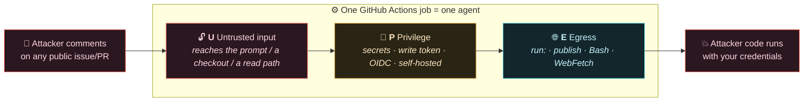
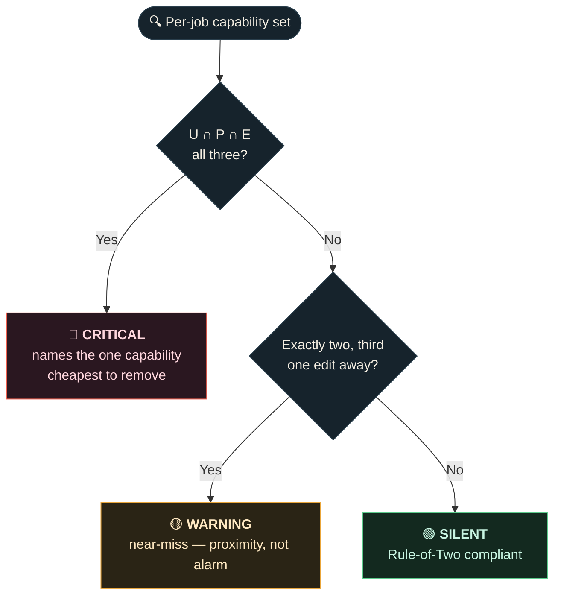
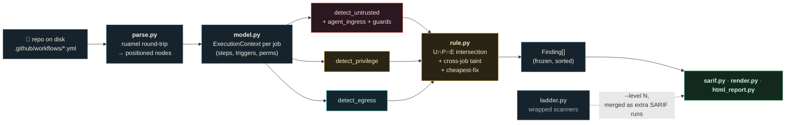
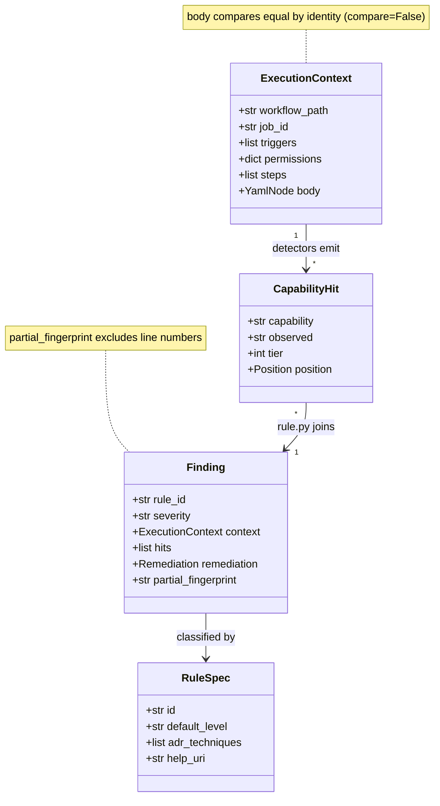
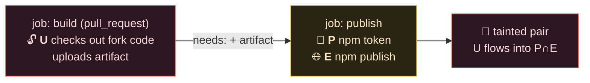
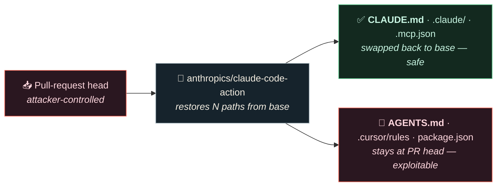
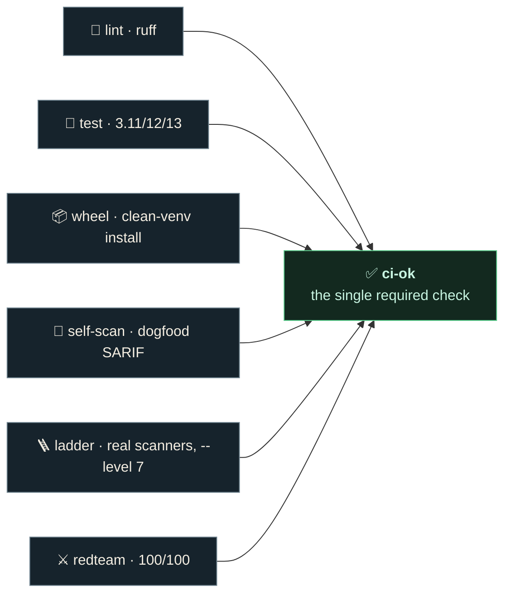

<div align="center">

# 🔺 TriDelPhi

### A static **Agents Rule of Two** analyzer for GitHub Actions — it finds the CI job where an attacker's comment becomes remote code execution, *before* one does.

[](https://github.com/girnarholdings/TriDelPhi/actions/workflows/ci.yml)
[](https://girnarholdings.github.io/TriDelPhi/)
[](https://pypi.org/project/tridelphi/)
[](LICENSE)
[](#-offline-by-design)

**[🌐 Website](https://girnarholdings.github.io/TriDelPhi/)** ·
**[📖 Rules](docs/RULES.md)** ·
**[🧭 Decisions](docs/DECISIONS.md)** ·
**[🔑 L7 design](docs/L7_PROPOSAL.md)** ·
**[⚙️ Setup](docs/REPO_SETUP.md)** ·
**[🛠️ Harden it further](#-harden-it-further)**

</div>

---

```console
$ pipx install tridelphi
$ tridelphi .
```

```
tridelphi 0.1.0 · Agents Rule of Two · 6 workflows, 20 jobs, 0.2s, offline

START HERE ────────────────────────────────────────────────────────────
CRITICAL .github/workflows/assist.yml:19   job "assist"
  tridelphi/agent-prompt-injection

  U  ${{ github.event.comment.body }} is interpolated into Claude Code
     Action's prompt input; the agent treats that text as instructions
  P  secrets.ANTHROPIC_API_KEY is available to this job
  E  Claude Code Action can use Bash, WebFetch

  Cheapest fix: strip U — gate the job on the commenter's association
  so only trusted accounts reach it. Escaping does not help; the
  injection is semantic, not syntactic.

  1 critical · 0 warning · 0 note
```

TriDelPhi builds a **per-job capability graph** from your workflows and flags the
jobs that simultaneously hold *untrusted input* (**U**), *privilege* (**P**), and
*egress* (**E**) — the [Agents Rule of Two](https://ai.meta.com/blog/practical-ai-agent-security/)
violation that turns a workflow into an exploit primitive. It is **offline by
default**, emits **SARIF 2.1.0**, and is the **L3 core** of an optional
seven-rung hardening ladder that wraps best-of-breed open-source scanners into
one merged report.

> **Proven against real attacks.** TriDelPhi catches the shape of the
> `tj-actions/changed-files` supply-chain takeover ([CVE-2025-30066][cve], 23,000+
> repos) and the `pull_request_target` pwn-request secret-exfiltration class
> (MITRE, Splunk, spotipy, timescale/pgai). Reproductions and unedited output:
> [`docs/REAL_WORLD.md`](docs/REAL_WORLD.md), guarded by `tests/test_realworld.py`.

[cve]: https://www.wiz.io/blog/github-action-tj-actions-changed-files-supply-chain-attack-cve-2025-30066

---

## 📑 Contents

- [The problem](#-the-problem) · [The rule](#-the-rule-two-is-fine-three-is-an-exploit)
- [**How a scan works** (architecture)](#-how-a-scan-works) · [The restore-semantics moat](#-the-part-no-other-scanner-does)
- [The hardening ladder L1–L7](#-the-hardening-ladder--l1l7) · [Output contract (SARIF)](#-output-contract)
- [Coverage vs ADR](#-coverage-against-a-published-taxonomy) · [Install & use](#-install) · [In CI](#-put-it-in-ci--one-line)
- [Credits](#-credits--standing-on-the-shoulders) · [**Harden it further**](#-harden-it-further)

---

## 🎯 The problem

In 2026 the dangerous CI jobs stopped *looking* dangerous. An AI agent that
reviews pull requests, a workflow that triages issues with an LLM, a
`pull_request_target` that checks out a fork — each is one crafted comment away
from running attacker code **with your repository's secrets**.

Line-level linters miss it because no single line is wrong. **The danger is the
combination**, and the combination is a property of the *job*, not the line.



## ⚖️ The rule: two is fine, three is an exploit

[Meta's **Agents Rule of Two**](https://ai.meta.com/blog/practical-ai-agent-security/)
says an agent should hold **at most two** of three properties. A GitHub Actions
job is an agent by that definition — TriDelPhi applies the rule statically to the
job as the unit of analysis.

| | Capability | What the detector looks for | Module |
|:--:|---|---|---|
| 🔓 | **U** — untrusted input | A fork-reachable trigger **plus a real ingress path**: an injected `${{ github.event.* }}`, a checkout of PR code, an agent reading attacker-editable files, `$GITHUB_ENV`/`$GITHUB_OUTPUT` injection, or a spoofable actor guard | `detect_untrusted.py`, `detect_agent_ingress.py`, `detect_guards.py` |
| 🔑 | **P** — privilege | `secrets.*`, a write-scoped `GITHUB_TOKEN`, `id-token: write`, or a self-hosted runner — gated by the **platform capability model** (a fork `pull_request` token is read-only regardless of settings) | `detect_privilege.py` |
| 🌐 | **E** — egress | Any `run:` step, a publish/deploy action, or an agent with `Bash`/`WebFetch` — **graded, not narrowed** (see [calibration](#-honest-calibration)) | `detect_egress.py` |



> **It stays quiet on the compliant majority.** A deploy job with a secret and a
> shell is *supposed* to exist (that's P ∩ E, only two). TriDelPhi does not cry
> wolf on it — that restraint is the difference between a tool people keep and
> one they mute.

## 🏗️ How a scan works

A scan is a deterministic pipeline: **parse → detect → intersect → serialize.**
No network, no state, no clock — the same repo always produces byte-identical
output, which is what makes the [baseline ratchet](#-the-ratchet) and the
[attestation](#-l6--attest--gate) trustworthy.



### The domain model

`parse.py` drives a [`ruamel.yaml`](https://pypi.org/project/ruamel.yaml/)
round-trip load and wraps it in `YamlNode` (`yamlnode.py`), a positioned cursor
that carries **1-indexed line/column** for every scalar and container — so every
finding points at the exact byte a reviewer must change. Each job becomes one
frozen `ExecutionContext`; detectors read it and emit typed `CapabilityHit`s.



### Cross-job taint propagation

A single job is rarely the whole story. `rule.py` propagates capability along
the `needs:` DAG and through the artifact upload/download channel: an
**untrusted** upstream job that hands state to a **privileged** downstream job
taints the pair, even though neither job holds all three alone. This is the
`cross-job-untrusted-flow` rule.



### Three properties that make it usable

- **Platform capability model.** A fork-originated `pull_request` gets a
  read-only token and no secrets *regardless of repo settings*. TriDelPhi
  encodes that, so **assumed** privilege never inflates a finding to critical —
  the classic false-positive that makes pwn-request scanners un-adoptable.
- **Cheapest-fix remediation.** For every critical, `rule.py` computes which of
  U/P/E is *cheapest to remove* and emits that as the fix, because telling a user
  "you have three capabilities" is not actionable — "gate this one trigger" is.
- **Determinism & line-independent fingerprints.** `Finding.partial_fingerprint`
  hashes the rule + job identity, **not** line numbers, so inserting a step above
  a job doesn't re-flag it. Output is sorted and byte-stable — the precondition
  for both the ratchet and reproducible attestation.

## 🛡️ The part no other scanner does

TriDelPhi knows **what each AI agent action restores from the base branch**
(`detect_agent_ingress.py`, driven by the tunable tables in `tables.py`).



A filename-matching scanner gets this **wrong in both directions**: it flags
`CLAUDE.md` (a false positive on the hardened, recommended setup) and says
nothing about `AGENTS.md` (the real finding). Getting the distinction right
requires a **per-action, per-version model of restore behaviour** — the part
that has to be maintained, and the part nobody else maintains. Extending it is a
[great first contribution](#-harden-it-further).

## 🪜 The hardening ladder — L1–L7

TriDelPhi core is the L3 capability-graph join. The rungs around it are commodity
checks that best-of-breed open-source tools already do superbly — so instead of
reimplementing them, `--level N` runs them as subprocesses and **merges their
SARIF as additional runs** into one document: one Security tab, one gate, each
tool credited with its own driver metadata and provenance.

| Rung | Tool | License | Invocation | Catches |
|:--:|---|:--:|---|---|
| **L1** | [gitleaks](https://github.com/gitleaks/gitleaks) | MIT | `gitleaks dir` | credentials committed to the tree (escalated to **error**) |
| **L2** | [osv-scanner](https://github.com/google/osv-scanner) | Apache-2.0 | `scan source -r` | known-vulnerable packages in your lockfiles¹ |
| **L3** | [zizmor](https://github.com/zizmorcore/zizmor) | MIT | `--format sarif --offline` | unpinned actions, template injection, workflow lint |
| **L3** | **tridelphi core** | Apache-2.0 | native | the U∩P∩E capability intersection — always runs |
| **L4** | [OSSF scorecard](https://github.com/ossf/scorecard) | Apache-2.0 | `--local --format json` → SARIF adapter | repo posture: branch protection, token perms, pinning¹ |
| **L5** | [semgrep](https://github.com/semgrep/semgrep) | LGPL-2.1 | `scan --config p/security-audit` | rule-based SAST of the application code itself¹ |
| **L6** | **tridelphi attest / gate** | Apache-2.0 | native | signed in-toto evidence + policy enforcement as its own step |
| **L7** | **tridelphi verify** + [gh](https://github.com/cli/cli) | Apache-2.0 / MIT | native trust-lock + `gh attestation verify` | signer/SHA-change detection (offline) + upstream provenance |

```console
tridelphi . --level 3      # lean default: secrets + supply chain + workflow lint + core
tridelphi . --level 6      # every rung, then write the evidence statement
tridelphi . --level 7      # + verify consumed actions against the trust-lock
tridelphi --credits        # who built what — the wrapped tools, with licenses
```

Rungs are cumulative and ordered by **signal density descending**. **Level 3 is
the default** — fast, and it stays off the heavier dependency trees; opt into 5+
for code SAST. A missing tool is **skipped with an install hint** — it never
fails the scan or hides TriDelPhi's own findings. ¹ osv-scanner, scorecard and
semgrep reach the network; `--offline` skips those rungs and the credit line
labels each honestly.

### 🔒 Containment: wrapped-tool output is untrusted input

The wrapped scanners read attacker-influenceable repository content, so their
**output is treated as hostile** before a byte reaches the merged document
(`orchestrate.py::sarif_shape_error` + `ladder.py`):

- **Bounded** — output over `MAX_OUTPUT_BYTES` (25 MB) is refused, not parsed.
- **Structurally gated** — one shared shape check (`runs`/`results`/`tool.driver`/
  `locations` types) rejects malformed SARIF; anything that fails becomes a
  diagnostic, never a crash.
- **Path-safe URI normalization** — external URIs are rewritten to repo-relative
  paths; a `../`-escaping or percent-encoded traversal is neutralized to an
  unambiguous absolute `file://` so it can never masquerade as an in-repo path.
- **Honest severity** — gitleaks emits no `level` (SARIF-defaults to warning); a
  live secret is escalated to **error**. scorecard's 0–10 scores map 0–3→warning,
  4–7→note, 8+→dropped.

This containment layer was hardened by two adversarial subagent passes (164
hostile-output tests); see the [red-team corpus](#-harden-it-further).

### 🔏 L6 — attest & gate

Scanning and enforcement are **deliberately separate processes**, so evidence
uploads before a gate fails the build and a policy change re-gates an old scan
without re-scanning:

```console
tridelphi . --level 6 --sarif-file out.sarif   # scan every rung, then attest
tridelphi gate out.sarif                        # enforce --fail-on as its own step
tridelphi attest out.sarif                      # write the in-toto evidence statement
```

`attest` emits an **unsigned in-toto Statement** — the SARIF's `sha256` as the
subject, the tools and severity counts as the predicate, and **no timestamp**, so
it is reproducible from its inputs. Signing is sigstore's job: the composite
action feeds the evidence to
[`actions/attest-build-provenance`](https://github.com/actions/attest-build-provenance)
(MIT), which signs it with the workflow's OIDC identity. `tridelphi init` also
drops [step-security/harden-runner](https://github.com/step-security/harden-runner)
(Apache-2.0) into the generated workflow to audit the scan job's own egress.

### 🔑 L7 — trust: the pawl SHA-pinning can't provide

L6 *produces* signed evidence; L7 is the **consumer** half — it asks the one
question the content rungs don't: *is what I consume still pinned to who it
claims to be?*

```console
tridelphi verify --write-trust-lock   # once: record each action's owner + pinned SHA
git add .tridelphi/trust.lock          # commit the pawl
tridelphi verify .                     # from now on, a changed signer/SHA fails the build
```

The **trust-lock** (`verify_cmd.py`) records the resolved owner and pinned SHA of
every third-party `uses:`. On a later run, an action whose SHA changed *under the
same ref* — or whose owner changed (a repo transfer) — is an **error**. This is
the case SHA-pinning cannot see: pinning defeats tag *mutation*, but a hijacked or
transferred upstream repo (the **tj-actions class**) looks like a legitimate new
SHA. The lock is **offline and deterministic** — no crypto, just the diff between
what you locked and what the workflow says now. A **tampered or corrupt lock reads
as empty** (every action becomes an unlocked `note`), never as "matches
everything." Where `gh` is present and online it also verifies upstream SLSA
provenance, reported at `note` because most 2026 actions publish none. Full
design and honest limits: [`docs/L7_PROPOSAL.md`](docs/L7_PROPOSAL.md).

## 📄 Output contract

Findings serialize to **SARIF 2.1.0** (`sarif.py`), the format GitHub code
scanning ingests. The output is a strict contract, self-tested every CI run:

- **Schema-validated** against the vendored OASIS draft-04 SARIF schema
  (`--self-check`; enforced in `tests/test_sarif_schema.py`).
- **Deterministic** — sorted, byte-identical for a given repo; `runs[0]` is
  always TriDelPhi and survives merging unchanged.
- **`partialFingerprints`** exclude line numbers so baselined findings survive
  edits above them.
- Text, JSON, HTML (`--format html`) and SARIF renderers all read the same
  `Finding[]` — output format never changes analysis.

## 🧭 Coverage against a published taxonomy

`tridelphi --coverage` maps every rule onto [Uber's **ADR**](https://github.com/uber/ADR)
17 agent threat techniques (MLSys 2026, arXiv:2605.17380) — and says plainly
where static analysis **cannot** reach:

```
[x] Agentic Control-Flow Hijacking             detected
[x] Indirect Prompt Injection                  detected
[x] Exploitation of Excessive Tool Permissions detected
[x] Agent Identity Spoofing                    partial
[ ] Tool Shadowing                             gap — statically reachable, no rule yet
[-] Long-Term Goal Hijacking                   runtime-only
...
9 of 11 statically reachable techniques have a rule; 6 of 17 are runtime-only.
```

**ADR is the runtime half; TriDelPhi is the static half.** ADR observes agent
sessions and detects hijacking as it happens; TriDelPhi finds the jobs where those
attacks would land, before anything runs. A `gap` (statically reachable, no rule
yet) is our published backlog — never hidden among the runtime-only ones. Closing
a gap is a [tracked contribution](#-harden-it-further).

## 📦 Install

```console
pipx install tridelphi          # recommended — isolated
pip install tridelphi           # or into your environment
uvx tridelphi .                 # or run without installing
```

**Python 3.11+. One runtime dependency: `ruamel.yaml`.** The wrapped ladder tools
are optional and detected on `PATH`.

## 🚀 Use it

```console
tridelphi .                                    # scan, human-readable
tridelphi . --format checklist                 # plain-language pass/fail, no jargon
tridelphi fix                                  # an ordered to-do list, cheapest change first
tridelphi fix --markdown                       # the same plan, ready to paste into a PR
tridelphi guard                                # fix interactively: yes/no per finding
tridelphi fix --apply                          # apply the automatic fixes, no prompts
tridelphi expose                               # what your shipped code + config actually leaks
tridelphi privatize --smoke-cmd "npm start"    # obfuscate built JS, verified or reverted
tridelphi . --format sarif --sarif-file s.json # for GitHub code scanning
tridelphi . --format html  --html-file r.html  # a self-contained report page
tridelphi --explain agent-config-ingress       # what a rule means and why
tridelphi --coverage                           # ADR taxonomy coverage
tridelphi --list-rules                         # every rule at a glance
```

### 🛠️ From finding to fix

`tridelphi fix` reads the same findings and turns them into a remediation plan
ordered by cost — a one-line change before a job restructure — so the shortest
path back to green is at the top. Each item names the exact `file:line`, the
capability to strip, the concrete change, and what it trades off. It is
**read-only** by default. `--markdown` renders the plan for a pull request or a
ticket, and the exit code follows the gate (1 while a critical remains, else 0).

### 🛡️ From fix to fixed — `tridelphi guard`

`tridelphi guard` closes the loop: for each finding it shows the exact solution
and asks one question — fix it now?

```
[y] fix it now   [c] comment out the step   [d] disable this workflow   [s] skip   [q] quit
```

Three findings have fully automatic fixes, because their remediation is
mechanical:

| Finding | The fix guard applies |
|---|---|
| expression injection | hoists **every** injected `${{ }}` in the step into a step `env:` var and quotes it in the script |
| pwn-request checkout | removes the `ref:`/`repository:` inputs that point checkout at the PR head |
| agent prompt injection | inserts the `author_association` job gate the remediation recommends |

Every accepted edit follows one contract: **snapshot → transform → re-scan →
verified clean, or rolled back to the exact original bytes**. A fix that cannot
prove it cleared the finding does not survive — guard will never leave a file
both changed *and* still vulnerable. Consent is per finding; skip, quit, and a
closed stdin all mean *no*. `--yes` (and `tridelphi fix --apply`) is the batch
spelling: automatic fixers only — it never comments out or disables anything.

Two details make the automatic fixes trustworthy rather than cosmetic. First,
the detectors **honor the tool's own advice**: adding the recommended
`author_association` gate genuinely clears the finding (and weak `github.actor`
gates or inverted tests deliberately do not). Second, the generated CI workflow
(`tridelphi init`) is a real gate: it posts the plain-English comment, uploads
the SARIF, **then fails the build** on a critical — with the ordered fix plan
written to the run's Summary tab and a pointer to `tridelphi guard`.

For ladder rungs (`--level N`) guard does not pretend to auto-edit other tools'
findings — it prints each tool's result with the exact next step a person
should take (rotate the leaked key, bump to the fixed release, which Settings
page to open).

### 💬 Reply-to-fix — `tridelphi fix` as a PR comment

`tridelphi init` installs a second workflow, `tridelphi-fix.yml`: reply
**`tridelphi fix`** on any pull request and the bot applies the automatic
fixes to the PR branch — the same `fix --apply` batch, every edit re-scanned
and kept only if the finding provably cleared — then replies with what it did.

A comment-triggered workflow holding `contents: write` is exactly the U∩P∩E
shape this tool exists to catch, so the bot is built the way our own
remediation demands, and it passes the scanner that ships it:

- only **OWNER / MEMBER / COLLABORATOR** comment authors can trigger it (the
  `author_association` gate — spoofable `github.actor` names don't count);
- the comment body is read **only inside `if:` expressions**, which GitHub
  evaluates before any shell exists — event text never reaches a shell;
- **fork PRs are skipped before checkout**: it only scans and pushes branches
  of the same repository, i.e. code written by someone with write access; and
  because `issue_comment` workflows run the file from the *default* branch, a
  PR cannot modify the bot that acts on it.

### 🔦 The exposure audit — `tridelphi expose`

The Rule-of-Two scan is about your CI. `tridelphi expose` is about your **shipped
product**: it audits committed code and config for what a vibe-coded app actually
leaks — and it is deliberately honest about what a *static* tool can and cannot
prove.

| Check | Finds | Engine |
|---|---|---|
| Shipped source maps + client secrets | a `.map` embedding your whole repo (`sourcesContent`), a live-key-shaped string in a `dist/` bundle | native |
| Password hashing | `md5`/`sha1` used on a password | semgrep (local rules) |
| User data in the clear | tokens in `localStorage`, PII in committed data files | semgrep + native |
| Self-hosted DB left open | a Compose DB on a public port with a default/empty password | native |
| Minification status | whether your bundle is already minified (so you know if more is even worth it) | native |

Two things keep it honest, which matters because the naïve version of this
feature makes people *less* safe:

- **It's static.** It reads committed code and config; it cannot reach a running
  database or server. The report says so on every run: a clean result is not a
  penetration test, and a flagged config may already be firewalled.
- **A browser can never keep a secret.** A key shipped in client JS is public the
  moment the page loads — so `expose` tells you to *rotate it and move it
  server-side*, never to hide it. (Obfuscation cannot hide a secret; see
  `tridelphi privatize` below, which is labelled plainly as "raises the effort of
  copying your logic — not security.")

The native detectors are pure file reads — offline, deterministic, no subprocess.
The code-pattern rung is semgrep run against a **bundled local ruleset**
(`--config <dir> --metrics off`, never the registry), so the whole audit keeps
the same "runs on your machine, nothing uploaded" promise as the core scan.
Output is the same plain-language checklist, SARIF, and paste-ready Markdown.

### 🕶️ The honest obfuscator — `tridelphi privatize`

Once `expose` is clean, `privatize` is the *optional* next step: it runs the
pinned [`javascript-obfuscator`](https://github.com/javascript-obfuscator/javascript-obfuscator)
(BSD-2) over your **built** JavaScript to raise the effort of reading it. It is
built to be honest about the two things the research makes non-negotiable:

- **It is not security, and it cannot hide a secret.** Before it touches a byte it
  re-runs the category-A secret check on your build and **refuses** if a live-key
  shaped string is present — obfuscation would hide that key from *you*, not from
  an attacker who can still read it in the browser. Rotate it and move it
  server-side first.
- **Obfuscators can silently miscompile** (peer-reviewed OOPSLA 2026 *OBsmith*
  found confirmed correctness bugs in this very tool). So `privatize` caps the
  transform to a safe preset, forces source maps off, skips vendor code, and keeps
  the result **only if your own smoke check passes** against it — otherwise it
  reverts to your exact original bytes. That verification is real, but it is not a
  guarantee.

```console
scripts/install-privatize.sh                    # once: pinned + integrity-verified install
tridelphi privatize --privatize-out dist \
  --smoke-cmd "node dist/main.js"               # obfuscate, verify, swap — or revert
```

It **refuses `--yes`** and is unreachable from `fix --apply` / `guard -y`: a
command that mutates files and runs your build always needs an explicit human
"yes". Without a `--smoke-cmd` it is a dry-run — it writes an obfuscated copy
beside your output and never swaps your live build.

### 🔁 The ratchet

You cannot fix everything today. Freeze what exists, block only what is new
(`baseline.py`):

```console
tridelphi . --write-baseline   # once: record today's findings as fingerprints
tridelphi .                    # from now on, only new findings gate
```

## ⚡ Put it in CI — one line

The composite action installs everything (version-pinned, **checksum-verified**),
climbs the ladder, uploads the merged SARIF, and posts a sticky PR comment:

```yaml
name: tridelphi
on:
  pull_request:
  push: { branches: [main] }
permissions:
  contents: read
  security-events: write
  pull-requests: write
jobs:
  harden:
    runs-on: ubuntu-latest
    steps:
      - uses: actions/checkout@v4
      - uses: girnarholdings/TriDelPhi@v1   # the whole ladder, one line
        with: { level: '3' }
```

Or `tridelphi init` writes a complete workflow for you. Prefer a hosted bot
across many repos? A Cloudflare Worker webhook front door lives in
[`bot/`](bot/), testable with `wrangler dev`.

### 🚦 Exit codes

| Code | Meaning |
|:--:|---|
| `0` | no findings at or above `--fail-on` (default `critical`) |
| `1` | findings at or above `--fail-on` |
| `2` | execution error — bad path, bad arguments, or `--strict-parse` on unparseable YAML |

`--min-severity` controls what you **see**; `--fail-on` controls what **breaks the
build**. Independent axes, both defaulting to `critical`.

## 🔒 Offline by design

No network calls, no account, no API token **by default** — it reads files on disk
and nothing else, air-gap safe and auditable in one sitting. Subprocesses spawn
only when you explicitly request the ladder (`--level`, `--with-zizmor`); the only
rungs that touch the network are osv-scanner/scorecard/semgrep, which `--offline`
skips and every credit line labels honestly.

## 📊 Honest calibration

Egress is true for **~9 jobs in 10** — a `run:` step is unrestricted network access
on a hosted runner. TriDelPhi *publishes* that rather than hiding it: the
discriminating join is **U ∩ P**, and E exists to rank findings and catch the rare
genuinely-contained job. Narrowing E would only manufacture false negatives, since
`run: node build.js` where the script fetches is invisible to any pattern.

## 🙏 Credits — standing on the shoulders

TriDelPhi orchestrates other people's excellent work and adds the capability-graph
join they don't do. Attribution is **structural** — each wrapped tool keeps its own
name, rules and provenance as a separate SARIF run — as well as documented here.
`tridelphi --credits` prints this from the CLI.

| Project | License | Role in TriDelPhi |
|---|:--:|---|
| [gitleaks](https://github.com/gitleaks/gitleaks) | MIT | L1 — secret scanning |
| [osv-scanner](https://github.com/google/osv-scanner) | Apache-2.0 | L2 — dependency vulnerabilities |
| [zizmor](https://github.com/zizmorcore/zizmor) | MIT | L3 — workflow linting |
| [OSSF Scorecard](https://github.com/ossf/scorecard) | Apache-2.0 | L4 — repo security posture |
| [semgrep](https://github.com/semgrep/semgrep) | LGPL-2.1 | L5 — application-code SAST |
| [step-security/harden-runner](https://github.com/step-security/harden-runner) | Apache-2.0 | L6 — runtime egress audit in the generated workflow |
| [actions/attest-build-provenance](https://github.com/actions/attest-build-provenance) | MIT | L6 — signs the evidence statement (OIDC) |
| [gh CLI](https://github.com/cli/cli) | MIT | L7 — upstream SLSA provenance verification |
| [ruamel.yaml](https://pypi.org/project/ruamel.yaml/) | MIT | the round-trip YAML parse with source positions |
| [OASIS SARIF 2.1.0 schema](https://docs.oasis-open.org/sarif/sarif/v2.1.0/) | — | vendored for output self-validation |
| [pytest](https://github.com/pytest-dev/pytest) · [ruff](https://github.com/astral-sh/ruff) · [jsonschema](https://github.com/python-jsonschema/jsonschema) | MIT | dev: tests, lint, schema checks |

Conceptual debts, gratefully: [Meta's Agents Rule of Two](https://ai.meta.com/blog/practical-ai-agent-security/)
(the thesis) and [Uber's ADR](https://github.com/uber/ADR) (the threat taxonomy).

## 🛠️ Harden it further

**TriDelPhi is a security tool that invites you to attack and extend it.** The
threat model treats scanned repositories *and* wrapped-tool output as hostile —
if you can make a scanned repo crash the scan, corrupt the merged SARIF, smuggle
a path outside the root, or slip a finding past the gate, that's a bug we want.
Concrete, high-value entry points:

| Want to… | Start here | The bar |
|---|---|---|
| **Add a detection rule** | a `RuleSpec` in `model.py` + logic in a `detect_*.py` + a malicious/clean fixture pair | `scripts/redteam.py` stays 100%, `--coverage` gains a technique |
| **Teach it a new AI action's restore semantics** | the tables in `tables.py` / `detect_agent_ingress.py` | a fixture proving CLAUDE-restore is *not* flagged, AGENTS-not-restored *is* |
| **Red-team the analyzer** | `tests/redteam_corpus.py`, `scripts/redteam.py` | add an attack shape it currently misses (then we fix it) |
| **Attack the containment layer** | `orchestrate.py::sarif_shape_error`, `ladder.py` | a hostile wrapped-tool output that crashes/escapes/mis-gates |
| **Harden the trust-lock** | `verify_cmd.py` (two takeover-hiding bugs already found here) | a `uses:`/lock shape where a real takeover reports clean |
| **Add a ladder rung** | a `ToolSpec` in `ladder.py` + pinned installer entry | pinned + checksum-verified, degrades gracefully when absent |
| **Close an ADR `gap`** | `coverage.py` + `data/adr_techniques.yml` | a real rule, not a re-labelling |

Security-sensitive reports: please use **private vulnerability reporting**
(Security tab) — see [`SECURITY.md`](SECURITY.md).

### Developing

```console
pip install -e ".[dev]"
pytest -q                                # 337 tests
ruff check tridelphi/ tests/ scripts/    # lint
python scripts/redteam.py --show-missed  # adversarial sweep (must stay 100%)
python -m build --wheel                  # packaging
```



`ci-ok` aggregates the rest and asserts each result is `success` — a cancelled or
skipped job is not success, the failure mode that lets untested merges through. A
test asserts it depends on every job, so adding one without wiring it in fails CI.
The **wheel** job installs the built artifact into a clean venv and runs the console
script from *outside* the checkout, catching missing `package-data` before a user does.

> ⚙️ Two repository settings a workflow cannot flip — serving the site and
> requiring `ci-ok` — are in [`docs/REPO_SETUP.md`](docs/REPO_SETUP.md).

## 📚 Docs

| Doc | What it is |
|---|---|
| 🌐 [**Website**](https://girnarholdings.github.io/TriDelPhi/) | The plain-English landing page, deployed from [`site/`](site/) |
| 🎯 [`docs/REAL_WORLD.md`](docs/REAL_WORLD.md) | TriDelPhi run against real disclosed attacks (tj-actions CVE-2025-30066, pwn-request), with output |
| 📖 [`docs/RULES.md`](docs/RULES.md) | Every rule, its ADR technique, why it fires |
| 🧭 [`docs/DECISIONS.md`](docs/DECISIONS.md) | What adversarial reviews changed before a line was written |
| 🔑 [`docs/L7_PROPOSAL.md`](docs/L7_PROPOSAL.md) | The senior-audit-engineer L7 design and its honest limits |
| 🗺️ [`docs/OSS_LANDSCAPE.md`](docs/OSS_LANDSCAPE.md) | Prior art: zizmor, poutine, Raven, octoscan, TaintAWI |
| ⚙️ [`docs/REPO_SETUP.md`](docs/REPO_SETUP.md) | The two settings that gate merges and serve the site; release runbook |
| 🤖 [`bot/`](bot/) · ▶️ [`action.yml`](action.yml) | Hosted-bot webhook front door · the one-line composite action |

---

<div align="center">
<sub>Apache-2.0 · offline by design · the capability-graph core of a seven-rung CI hardening ladder.<br/>
Built to be attacked, extended, and understood.</sub>
</div>
